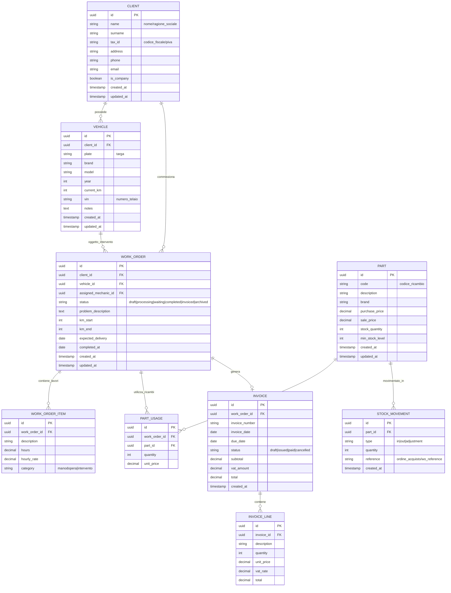

# PROJECT_BRIEF.md - Gestionale Officina Meccanica

## 1. Requisiti Funzionali Core (MVP)

### 1.1 Anagrafica Clienti e Veicoli
- **Clienti**: registrazione, modifica, eliminazione dati anagrafici (nome, cognome/Ragione Sociale, indirizzo, telefono, email, Partita IVA)
- **Veicoli**: associazione veicolo-cliente, targa, marca, modello, anno immatricolazione, km attuali, note tecniche
- **Storico interventi per veicolo**: visione completa della storia delle riparazioni

### 1.2 Gestione Ordini di Lavoro (Work Orders)
- **Apertura ordine**: selezione cliente/veicolo, descrizione problema segnalato, km rilevati, data prevista consegna
- **Stati ordine**: Bozza → In Lavorazione → In Attesa Ricambi → Completato → Fatturato → Archiviato
- **Lavorazioni**: aggiunta voci di lavoro (manodopera, tempi, descrizione intervento)
- **Assegnazione meccanico**: responsabilità dell'intervento
- **Note interne**: comunicazioni tra operatori
- **Chiusura ordine**: riepilogo finale, km conclusione, firma cliente (opzionale)

### 1.3 Catalogo Ricambi e Gestione Magazzino
- **Anagrafica ricambi**: codice ricambio, descrizione, marca compatibile, prezzo acquisto, prezzo vendita, giacenza minima
- **Movimenti magazzino**: carico (acquisti), scarico (vendite/ordini), valorizzazione giacenza
- **Alert giacenza**: notifiche per scorte sotto soglia minima
- **Ricerca ricambi**: per codice, descrizione, marca

### 1.4 Preventivi e Fatturazione Base
- **Preventivi**: generazione da ordine di lavoro, dettaglio voci, totale, validità preventivo
- **Converti preventivo in ordine**: trasformazione in lavoro effettivo
- **Fatturazione**: generazione fattura da ordine completato, dati fiscali configurabili, riepilivo imponibile/IVA/totale
- **Stampa PDF**: documenti formattati per stampa

### 1.5 Dashboard Riepilogativa
- **KPI principali**: ordini aperti oggi, ordini in lavorazione, ricavi del mese, veicoli in attesa
- **Grafici**: andamenti mensili (ricavi, numero interventi)
- **Scadenze**: prossime consegne, ricambi ordinati in arrivo

---

## 2. Requisiti Non Funzionali

### 2.1 Architettura
- **On-premise**: nessuna dipendenza da servizi cloud, tutti i dati risiedono localmente
- **Single-tenant**: un'unica istanza per un'unica officina
- **Local network**: accessibile da 1-5 utenti simultanei nella rete locale (LAN)

### 2.2 Piattaforma Hardware
- **OS supportati**: Windows 10/11, Linux (Ubuntu/Debian)
- **Requisiti minimi**: CPU dual-core, 4GB RAM, 20GB disco
- **Installation semplificata**: deployment con Docker Compose

### 2.3 Backup e Sicurezza
- **Backup locale**: export automatico giornaliero su disco locale
- **Ritention backup**: conservazione ultimi 30 backup
- **Restore**: procedura di ripristino da backup
- **Nessuna esposizione internet**: il sistema NON è esposto su internet (accesso solo da LAN)

### 2.4 Usabilità
- **Interfaccia intuitiva**: pensata per meccanici, non per esperti IT
- **Responsive**: utilizzabile su tablet in officina
- **Offline parziale**: le operazioni core funzionano anche senza rete (se frontend e backend sulla stessa macchina)

---

## 3. Stack Tecnologico Consigliato

### Scelta Motivate

| Componente | Tecnologia | Motivazione |
|------------|------------|-------------|
| **Backend** | Python FastAPI | Leggero, performante, documentazione automatica OpenAPI, eccellente integrazione con database, curva di apprendimento bassa |
| **Frontend** | Vue.js 3 + PrimeVue | Componente UI specializzate per business app, reactivity eccellente, documentation completa, più leggero di React |
| **Database** | PostgreSQL | Robusto per accesso multi-utente concorrente, supporto transazioni ACID, JSON per dati flessibili, gratuito |
| **Deployment** | Docker Compose | Installazione one-click, isolamento dipendenze, facilità backup/migrazione |
| **PDF Generation** | WeasyPrint/ReportLab | Generazione lato server, template flessibili |

### Perché Non Altre Scelte

- **Django**: troppo complesso per MVP, overkill per questa dimensione
- **Node.js**: meno adatto per operazioni heavy CPU-bound (report PDF), ecosistema frammentato
- **React**: più verbose, richiede più configurazione, steeper learning curve per team piccoli
- **SQLite**: problemi di concorrenza con utenti multipli, locking in scrittura
- **Tauri/Electron**: aggiunge complessità packaging, il browser è sufficiente per LAN

---

## 4. Struttura Cartelle Progetto

```
garage-manager/
├── backend/
│   ├── app/
│   │   ├── api/              # Endpoint API (routes)
│   │   │   └── v1/
│   │   │       ├── clients.py
│   │   │       ├── vehicles.py
│   │   │       ├── work_orders.py
│   │   │       ├── parts.py
│   │   │       ├── invoices.py
│   │   │       └── dashboard.py
│   │   ├── core/             # Configurazione core
│   │   │   ├── config.py     # Settings
│   │   │   ├── security.py   # Autenticazione/autorizzazione
│   │   │   └── database.py   # Connessione DB
│   │   ├── models/           # Modelli SQLAlchemy (DB)
│   │   │   ├── client.py
│   │   │   ├── vehicle.py
│   │   │   ├── work_order.py
│   │   │   ├── part.py
│   │   │   └── invoice.py
│   │   ├── schemas/          # Pydantic schemas (DTO)
│   │   ├── services/         # Logica di business
│   │   │   ├── backup_service.py
│   │   │   └── pdf_service.py
│   │   ├── utils/            # Utility helper
│   │   └── main.py           # Entry point FastAPI
│   ├── tests/                # Test unitari
│   ├── requirements.txt      # Dipendenze Python
│   └── Dockerfile
│
├── frontend/
│   ├── public/
│   ├── src/
│   │   ├── assets/           # CSS, immagini statiche
│   │   ├── components/       # Componenti Vue riutilizzabili
│   │   │   ├── common/       # Bottoni, input, tabelle
│   │   │   └── domain/       # Componenti business
│   │   ├── composables/      # Vue composables (hooks)
│   │   ├── layouts/          # Layout principali
│   │   ├── pages/            # Viste/pagine
│   │   │   ├── Dashboard.vue
│   │   │   ├── Clients.vue
│   │   │   ├── Vehicles.vue
│   │   │   ├── WorkOrders.vue
│   │   │   ├── Parts.vue
│   │   │   └── Invoices.vue
│   │   ├── router/           # Vue Router config
│   │   ├── stores/           # Pinia stores (state)
│   │   ├── services/         # Chiamate API
│   │   ├── types/            # TypeScript types
│   │   ├── App.vue
│   │   └── main.ts
│   ├── index.html
│   ├── package.json
│   ├── vite.config.ts
│   ├── tsconfig.json
│   └── Dockerfile
│
├── docker-compose.yml        # Orchestrazione servizi
├── .env.example              # Template configurazione
└── README.md                 # Istruzioni installazione
```

---

## 5. Diagramma ER (Entità-Relazioni)



### Note sulle Relazioni

1. **Cliente → Veicolo**: uno a molti (un cliente può avere più veicoli)
2. **Cliente → Ordine**: uno a molti (un cliente può avere più ordini nel tempo)
3. **Veicolo → Ordine**: uno a molti (ogni veicolo ha storico interventi)
4. **Ordine → Ricambi**: molti a molti (tramite tabella part_usage)
5. **Ordine → Fattura**: uno a uno (un ordine genera una fattura)

---

## 6. Considerazioni Aggiuntive

### Fase 2 (Post-MVP)
- Integrazione con gestionale contabile esterno
- Modulo preventivi avanzato con template
- Gestione appuntamenti/calendario
-Statistiche avanzate e report
- Multi-utente con ruoli (admin/meccanico/ receptionist)

### Scalabilità
- Lo stack proposto supporta fino a 20-30 utenti senza modifiche architetturali
- Per crescita superiore: migrazione a microservizi, cache Redis, load balancer

### Manutenzione
- Il backend Python è stabile e manutenibile nel lungo periodo
- Vue.js ha una community attiva e duratura
- PostgreSQL è lo standard de facto per database relazionali
